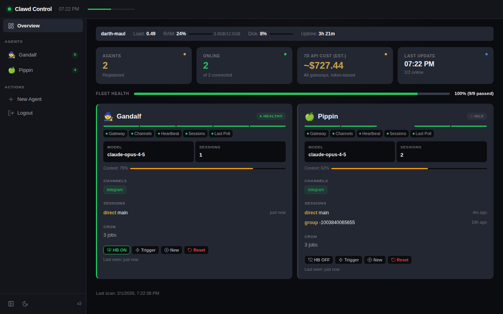

# 🏰 Clawd Control

Real-time dashboard for monitoring and managing [Clawdbot](https://github.com/clawdbot/clawdbot) AI agents.

<!-- Screenshot -->

-->

## What is this?

Clawd Control gives you a single-screen view of your entire AI agent fleet. If you run [Clawdbot](https://github.com/clawdbot/clawdbot) agents, this is your mission control.

## Features

- **Live monitoring** — Real-time status, health, and metrics via SSE
- **Fleet overview** — See all agents at a glance with health indicators
- **Agent detail views** — Deep dive into any agent's sessions, channels, config
- **Agent creation wizard** — Spin up new agents with guided setup
- **Host metrics** — CPU, RAM, disk usage for your machine
- **Auto-discovery** — Finds local Clawdbot agents automatically
- **SPA navigation** — Instant page transitions, no reloads
- **Dark/light theme** — Toggle with `T`, or follows system preference
- **Password auth** — Simple session-based authentication
- **Keyboard shortcuts** — `B` toggle sidebar, `T` toggle theme, `?` for help

## Quick Start

```bash
# Clone
git clone https://github.com/Temaki-AI/clawd-control.git
cd clawd-control
npm install

# Run — auto-discovers local Clawdbot agents
npm start
```

Open `http://localhost:3100` and log in with the generated password (printed to console on first run).

### Manual agent configuration

If auto-discovery doesn't find your agents (remote hosts, custom ports):

```bash
cp agents.example.json agents.json
```

Edit `agents.json`:

```json
{
  "agents": [
    {
      "id": "my-agent",
      "gatewayAgentId": "main",
      "name": "My Agent",
      "emoji": "🤖",
      "host": "127.0.0.1",
      "port": 18789,
      "token": "YOUR_GATEWAY_TOKEN",
      "workspace": "/path/to/agent/workspace"
    }
  ],
  "pollIntervalMs": 15000,
  "hostMetricsIntervalMs": 30000
}
```

## Configuration

| Option | Default | Description |
|--------|---------|-------------|
| `--port` | `3100` | HTTP port |
| `--bind` | `0.0.0.0` | Bind address (use `127.0.0.1` for local-only) |

### Authentication

On first run, a random password is generated and saved to `auth.json`. You'll see it in the console output. To set your own:

```json
{
  "password": "your-password-here",
  "sessionTtlHours": 24
}
```

## Architecture

Clawd Control is deliberately simple — a single Node.js server with no build step, no framework, no bundler. The frontend is vanilla HTML/JS with a shared layout module.

```
server.mjs          → HTTP server, SSE, auth, API proxy
layout.js           → Shared sidebar, topbar, theme, navigation
dashboard.html      → Fleet overview (main page)
agent-detail.html   → Individual agent deep dive
create.html         → Agent creation wizard
collector.mjs       → Background data collector (polls agents)
discover.mjs        → Auto-discovers local Clawdbot agents
create-agent.mjs    → Agent provisioning logic
security-lib/       → Auth, rate limiting, security headers
```

### Requirements

- **Node.js** 18+ (uses native fetch)
- **Clawdbot** agents running locally or on your network
- One dependency: `ws` (WebSocket client for agent communication)

## FAQ

**Q: Do I need Clawdbot installed?**
Yes — Clawd Control is a dashboard *for* Clawdbot agents. Install Clawdbot first: `npm install -g clawdbot`

**Q: Can I monitor remote agents?**
Yes — add them to `agents.json` with their host/port/token. The agents need to be network-reachable.

**Q: Is this related to Temaki?**
Clawd Control is a standalone open-source project. It pairs well with [Temaki.ai](https://temaki.ai) — a collaborative workspace where humans and AI agents work together. Think of Clawd Control as your agent ops dashboard, and Temaki as where agents actually collaborate with your team.

## Community

- 🌐 [clawdcontrol.com](https://clawdcontrol.com) — Landing page & waitlist
- 💬 [Discord](https://discord.gg/NveJTZaD) — Join the community
- 📖 [Clawdbot Docs](https://docs.clawd.bot) — Full documentation
- 🐛 [Issues](https://github.com/Temaki-AI/clawd-control/issues) — Bug reports and feature requests

## Contributing

Contributions welcome! This project favors simplicity — no build tools, no frameworks, vanilla everything. If your PR adds a `node_modules` folder the size of a small country, we need to talk.

## License

MIT — do whatever you want with it.
